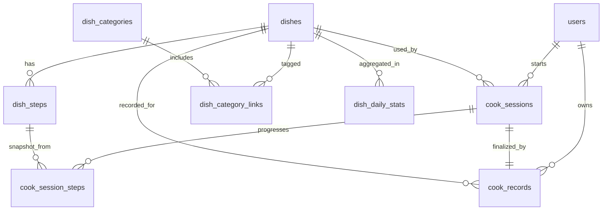

# PostgreSQL Schema Design

## Overview

The schema supports the 5 core modules:
- Catalog: `dishes`, `dish_categories`, `dish_category_links`
- Detail: `dish_steps`
- Cook mode: `cook_sessions`, `cook_session_steps`
- Completion record: `cook_records`
- Today count fallback: `dish_daily_stats`

## Entity Relationship (logical)

## Table List

1. `users`
   - Basic user identity for ownership and record query.
2. `dish_categories`
   - Category metadata for browsing and filters.
3. `dishes`
   - Dish core fields (name, difficulty, duration).
4. `dish_category_links`
   - Many-to-many between dishes and categories.
5. `dish_steps`
   - Ordered step instructions and per-step timer.
6. `cook_sessions`
   - Runtime session status and current step.
7. `cook_session_steps`
   - Per-step execution history within one session.
8. `cook_records`
   - Final completion records (success/fail + optional rating).
9. `dish_daily_stats`
   - Daily aggregate counts for fast DB fallback.

## Constraints and Guarantees

- Step order uniqueness: `UNIQUE (dish_id, step_no)`.
- Session step order uniqueness: `UNIQUE (session_id, step_no)`.
- Idempotent completion: `cook_records.session_id` is unique.
- Strict status enums via `CHECK` constraints.
- Non-negative timers and counts via `CHECK` constraints.

## Trigger Behavior

- `set_updated_at()` updates `updated_at` on mutable tables.
- `trg_cook_record_daily_stats` increments `dish_daily_stats` on each new `cook_records` row.

## Index Strategy

- Dishes browse and filter indexes
- Step read indexes by `dish_id, step_no`
- Session read/update indexes by `dish_id, status, started_at`
- Record history index by `user_id, cooked_at desc`
- Daily stats index by `dish_id, stat_date`

See SQL scripts under `database/postgres/` for exact DDL.
